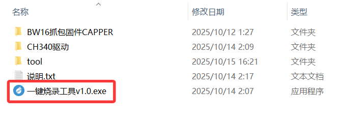
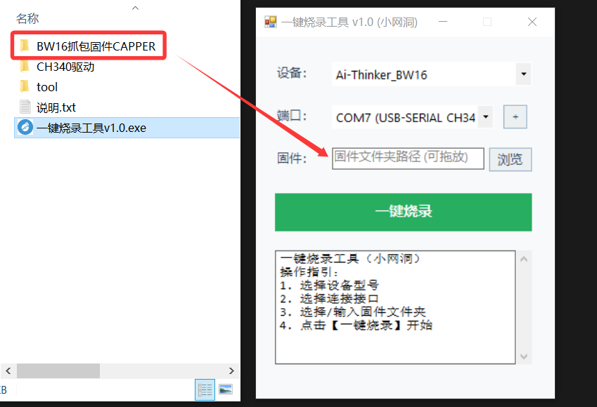
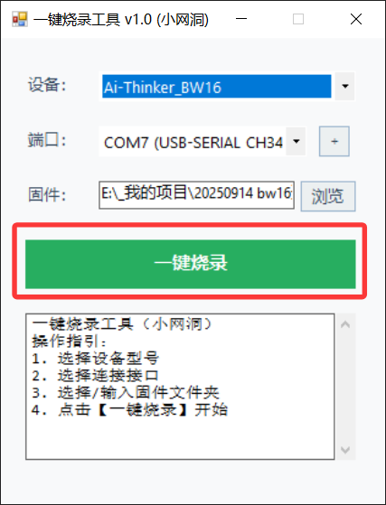
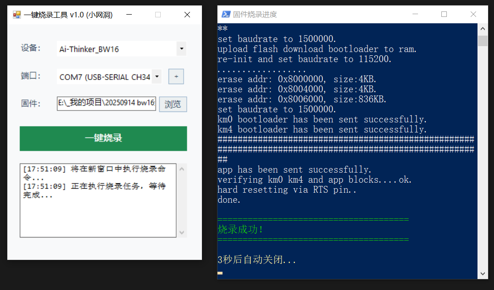
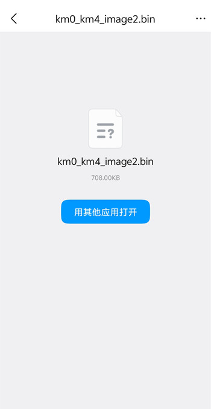
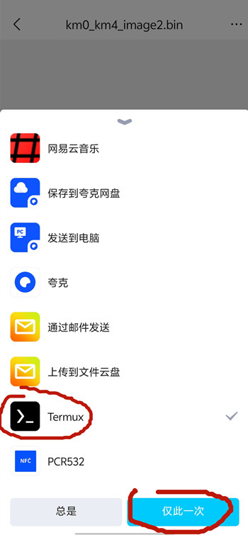
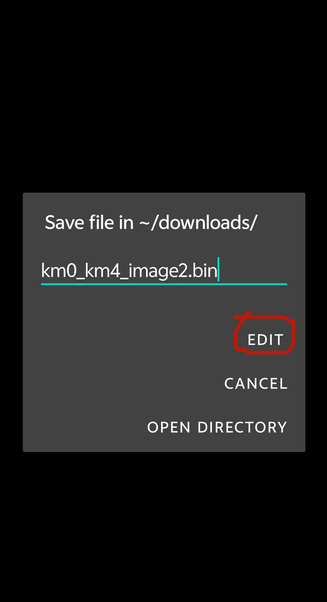
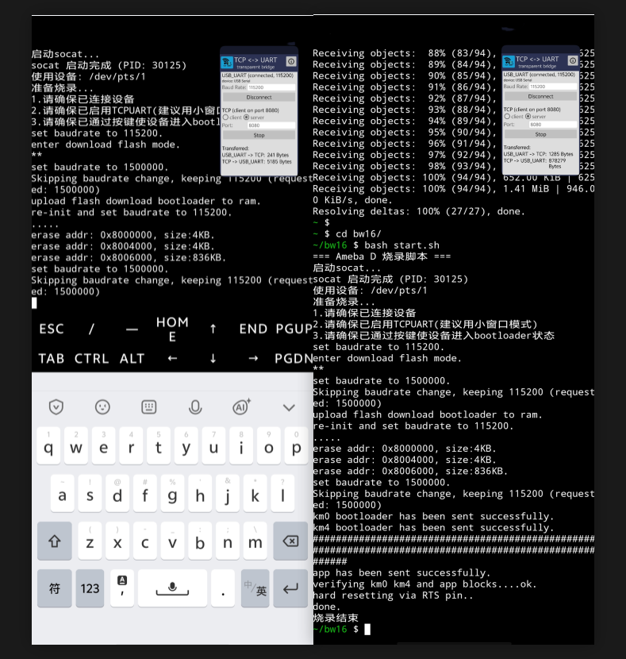

# bw16-flash-tool

## 1. 介绍
本项目提供windows（电脑）和android（手机）环境下烧录bw16固件的工具以及操作方法。

并提供抓包固件和杀手固件用于烧录测试与使用。

> 抓包固件来源：https://github.com/Cancro29/RTL8720dn-Handshake-Capture
>
> 杀手固件来源：https://github.com/tesa-klebeband/RTL8720dn-Deauther

------

## 2. Win烧录

下载windows一键烧录工具。

1.使用Type-c数据线连接电脑与开发板，然后点击烧录工具启动。

2.确保已经识别到设备端口如果没有点击旁边加号“+”刷新下，如果仍然没有安装下文件夹中的“CH340驱动”。

3.把抓包固件文件夹拖入固件路径中（如果是Win7需手动复制路径并输入）。

4.点击一键烧录，等待完成即可。

------

## 3. 安卓烧录

**【前置条件】**需要安装两个APP，**Termux**（手机应用商城可以直接搜到）和**TCPUART**（谷歌应用商店可以搜到）

### 3.1. 连接bw16

使用双type-c连接线（没有可以用常规数据线接一个usb转type-c接头）连接bw16开发板和手机。然后先按住开发板右边的烧录键（Burn）不要松开，接着按一下左边的重置（RST）键，然后松开右边的烧录键。这时开发板进入BootLoader状态，以进行后续烧录。

### 3.2. 导入固件

找到下载好的固件（网盘、浏览器、QQ等），找到“**用其他应用打开**”，选择**Termux**。

注意固件名称必须为`km0_km4_image2.bin`，不能为其他名字（如`km0_km4_image2(1).bin`是不正确的，需要修改正确），点击**EDIT**，然后后面有个弹窗点确定即可。

### 3.3. 开始烧录

打开**TCPUART**，点击Connect连接设备，切换server模式，点击Start。然后将应用变为小窗模式防止应用休眠（这步不确定是不是必要的，但是笔者的手机不做这步会有问题）。

打开**termux**，依次输入如下命令，等待烧录完成。

- 安装git

~~~
pkg install git
~~~

- 获取烧录工具

~~~
git clone https://github.com/wangdong0/bw16-flash-tool
~~~

- 进入文件夹并执行烧录

~~~
cd bw16
bash start.sh
~~~

烧录完成，确认没有报错，重新上电使用即可。